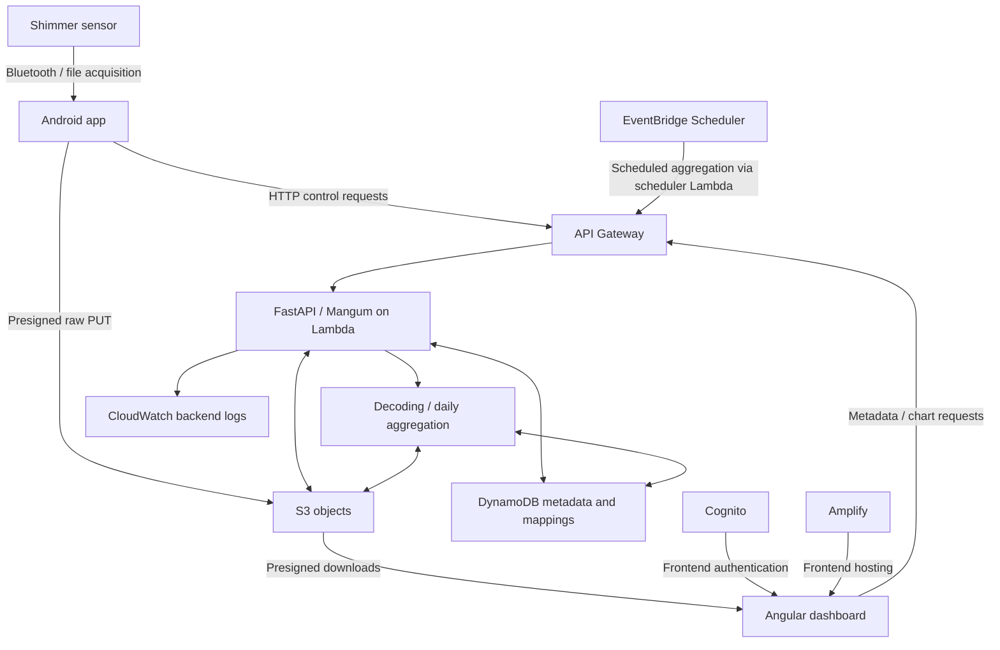

# Shimmer cloud stack

## Project overview

This project connects Shimmer wearable sensors, an Android client, an AWS backend, and an Angular web dashboard. It supports sensor recording uploads, Shimmer decoding, metadata storage, daily aggregation, visualization, and downloads. This parent repository pins the three application repositories as Git submodules and provides shared documentation and validation tools.

## Architecture overview



The backend processes recordings and stores raw/derived objects and metadata; the dashboard retrieves them through API calls and temporary download URLs. See [System Architecture](docs/SYSTEM_ARCHITECTURE.md) for detailed mechanisms.

## Repository layout

The first three directories are **Git submodules**, each with its own history and development workflow.

| Path | Role |
| --- | --- |
| [shimmer-data-sync-api/](shimmer-data-sync-api/) | FastAPI backend, Mangum/Lambda and API Gateway integration, S3/DynamoDB storage, Shimmer decoding, and aggregation. |
| [shimmer-docking-android/](shimmer-docking-android/) | Android Shimmer acquisition, local files and synchronization state, and backend upload protocol. |
| [shimmer-sensor-dashboard/](shimmer-sensor-dashboard/) | Angular frontend, Amplify hosting, Cognito login, data visualization, and downloads. |
| [tools/](tools/) | Development/validation utilities, including the HTTP-only Android upload simulator. |
| [docs/](docs/) | Shared system documentation, operation instructions, and validation guides. |

## Main data flow

```text
POST /missing-files/
→ GET /generate-upload-url/
→ direct presigned S3 PUT
→ POST /decode-and-store/
→ decoded JSON + DynamoDB metadata
→ dashboard
```

The backend generates a temporary presigned S3 PUT URL for the requested filename. Android uploads the raw bytes directly to S3 using that URL, then asks the backend to decode the stored recording. AWS credentials are not stored on the phone for this protocol; Lambda and API Gateway do not proxy the raw upload itself.

See [System Architecture](docs/SYSTEM_ARCHITECTURE.md#3-smartphone-to-cloud-protocol) for the protocol and [Upload Simulation and Validation](docs/UPLOAD_SIMULATION_VALIDATION.md) for reproducible checks.

## Current deployment

| Component | URL / Region |
| --- | --- |
| Frontend | https://clone.djm6m1z6lh719.amplifyapp.com |
| Backend API | https://wwr1eh4vg9.execute-api.us-east-2.amazonaws.com |
| AWS Region | `us-east-2` |

Open the frontend for lab operations. The backend URL serves the Android client, simulator, and API checks. See the [Operation Guide](docs/OPERATION_GUIDE.md) for signup/login, device/patient mapping, and recording inspection.

## Quick start

Clone with all submodules using the parent repository's current SSH remote. GitHub SSH access to the parent and submodule repositories is required.

```bash
git clone --recurse-submodules git@github.com:hellowPluto78700/shimmer-cloud-stack.git
cd shimmer-cloud-stack
```

For an existing parent checkout:

```bash
git submodule update --init --recursive
```

Application development happens inside the relevant submodule. Consult its README and deployment documentation for component-specific setup; use the shared guides below for the deployed system.

## Documentation

### System architecture

[docs/SYSTEM_ARCHITECTURE.md](docs/SYSTEM_ARCHITECTURE.md) — Architecture, AWS mechanisms, storage, decoding, aggregation, and the API/security model.

### Operation guide

[docs/OPERATION_GUIDE.md](docs/OPERATION_GUIDE.md) — Frontend signup/login, device/patient mapping, Android usage, upload workflow, and troubleshooting.

### Upload simulation and validation

[docs/UPLOAD_SIMULATION_VALIDATION.md](docs/UPLOAD_SIMULATION_VALIDATION.md) — HTTP-only Android simulation, presigned URL upload, end-to-end validation procedure, and AWS/backend/frontend verification.

## HTTP-only upload simulator

[tools/simulate_android_upload.py](tools/simulate_android_upload.py) reproduces the Android cloud upload protocol without a phone. From the parent repository root, with Python 3 and network access:

```bash
python3 tools/simulate_android_upload.py
```

It uses a unique filename and a real Shimmer fixture from backend Git history (`b19efb0:test_files/000`) when that fixture is absent from the checkout. The historical commit must be available locally. No extra Python packages, frontend login, or AWS credentials are required. Successful runs retain a new recording in the deployed clone.

Supported options are `--file PATH` for another real fixture, `--filename NAME` for a fresh upload basename, and `--api-base URL`. The API option accepts only the current clone; arbitrary backend URLs are rejected. Use `--help` for CLI details.

The checks cover the HTTP protocol, presigned S3 PUT, decode-and-store, raw/decoded S3 downloads, byte equality, and frontend-visible metadata read from DynamoDB through the API. Independent DynamoDB/S3 checks are documented in the [validation guide](docs/UPLOAD_SIMULATION_VALIDATION.md). The simulator does **not** validate Bluetooth, Android's local database, lifecycle/background service, phone permissions, or authenticated frontend/chart interaction.

## Validation status

The repository's recorded validation snapshot is **2026-10-06**. These are evidence-backed results, not a claim that every user workflow has passed.

| Area | Recorded status / evidence |
| --- | --- |
| Backend core API and presigned S3 upload | Passed live contract checks; [CORE validation](shimmer-data-sync-api/CORE_VALIDATION.md). |
| Real Shimmer decode and storage | Passed real-fixture decode (30,240 samples), decoded S3 verification, raw byte comparison, and DynamoDB metadata checks; [upload validation](docs/UPLOAD_SIMULATION_VALIDATION.md). |
| Frontend deployment | Amplify deployment, login/signup form rendering, unauthenticated redirect, and browser-origin metadata/chart/download requests passed; [frontend evidence](shimmer-sensor-dashboard/DEPLOYMENT.md). |
| Cognito signup/login | Configuration and forms verified; actual account creation, email confirmation, successful sign-in/out, and authenticated dashboard interaction remain pending in the [frontend evidence](shimmer-sensor-dashboard/DEPLOYMENT.md). |
| Daily aggregation | Output values and separate same-date group summaries verified; [aggregation validation](shimmer-data-sync-api/AGGREGATOR_VALIDATION.md). |
| Scheduler manual execution | Backfill request, output/state, and repeat execution passed; enabled schedule configuration verified. Naturally timed execution is not yet observed in the [scheduler evidence](shimmer-data-sync-api/AGGREGATOR_VALIDATION.md). |
| HTTP-only Android simulator | All eight stages passed, including frontend-visible metadata and raw byte verification; [simulator evidence](tools/README.md). |

Physical Android + Bluetooth/Shimmer end-to-end behavior is not yet fully validated. Large-volume production performance is uncharacterized. See the [architecture limitations](docs/SYSTEM_ARCHITECTURE.md#11-validation-status-and-known-limitations) before interpreting these results as production acceptance.

## Security note

Cognito gates frontend user login. The current backend API does **not** require a Cognito JWT, API key, or other caller authentication; anyone who knows and can reach the endpoint can potentially invoke its API operations. Frontend login does not authenticate direct backend requests.

Presigned S3 URLs are scoped and temporary, and no permanent AWS credentials are exposed to Android. Treat signed URLs as private access capabilities. See the [architecture security model](docs/SYSTEM_ARCHITECTURE.md#5-authentication-and-security-model) for the current boundary.

## Development workflow

1. Enter the relevant submodule and make/commit application changes there.
2. Return to the parent repository.
3. Commit the updated submodule pointer in the parent so others receive the intended version.

Check both the parent and submodules:

```bash
git submodule status
git status --ignore-submodules=none
git submodule foreach 'git status --short'
```

A clean parent working tree alone does not guarantee that every submodule is unchanged, especially when submodule changes are ignored by Git configuration. Verify submodule status before committing or handing off a checkout.
