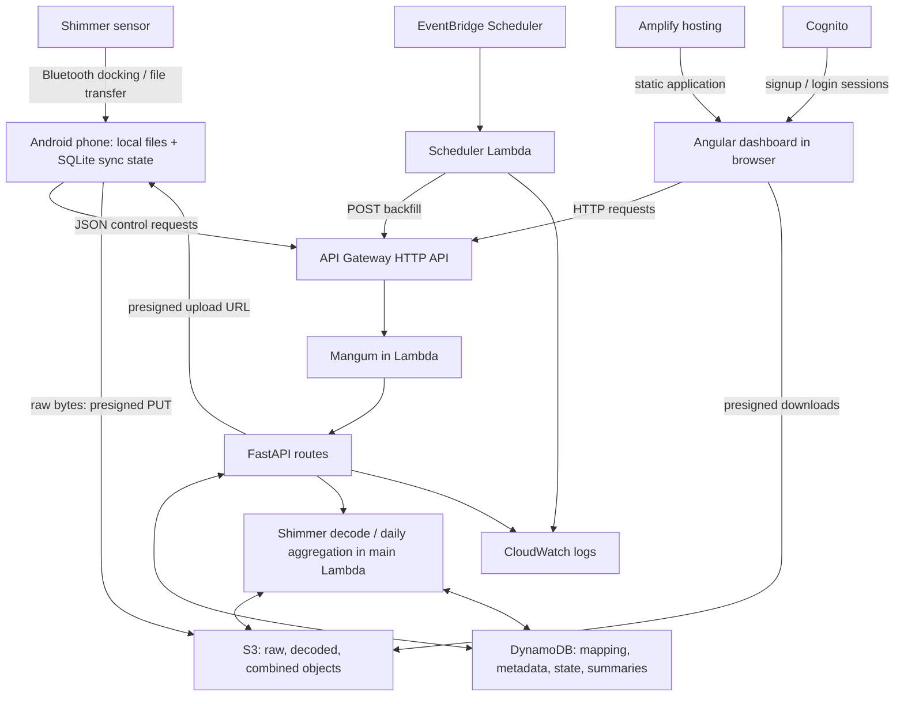
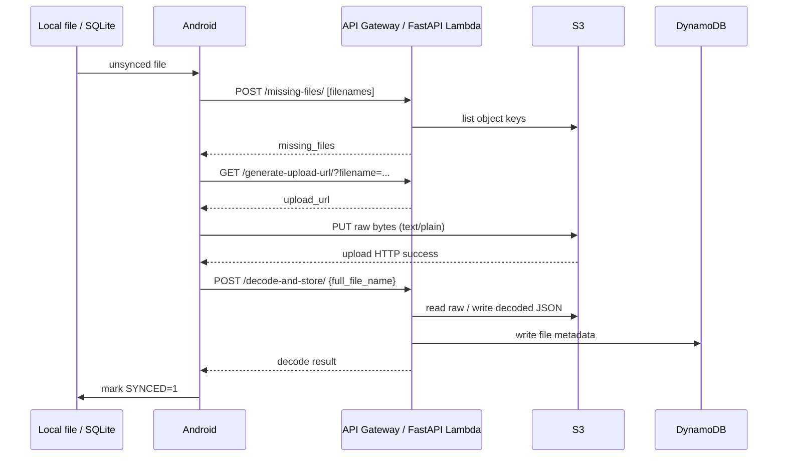

# Shimmer cloud system architecture

This document explains the mechanisms of the deployed clone for developers and researchers. For account creation, uploads, dashboard use, and troubleshooting, use the [Operation Guide](OPERATION_GUIDE.md).

Evidence snapshot: 2026-10-06. Backend: `https://wwr1eh4vg9.execute-api.us-east-2.amazonaws.com`; frontend: `https://clone.djm6m1z6lh719.amplifyapp.com`; region: `us-east-2`. Current source pins are backend `075185f`, frontend `3be98ac`, Android `8086db8`; parent commit `4a0a72d` supplies the validated HTTP simulator. The live `/openapi.json` and frontend HTTP 200 were checked during this documentation review. Resource configuration and functional results below come from the linked deployment/validation reports; this review did not change cloud resources or repeat cloud writes.

## 1. System overview



The phone transfers a recording from Shimmer to local storage, uploads its bytes, and requests decoding. The backend stores raw and derived objects in S3 and searchable metadata in DynamoDB. Daily processing combines decoded recordings. Angular retrieves metadata and chart fields through the API and downloads objects through temporary S3 URLs.

| Repository | Responsibility |
| --- | --- |
| `shimmer-docking-android` | Bluetooth discovery/docking/file transfer, local recording files and SQLite metadata, cloud synchronization, device/patient mapping dialog. |
| `shimmer-data-sync-api` | FastAPI contracts, Mangum Lambda adapter, S3 capabilities, mappings and metadata, calibrated decoder, aggregation and scheduler, backend SAM definition. |
| `shimmer-sensor-dashboard` | Angular views, Amplify Authenticator, API client, chart/download controls, mapping editor, frontend auth/hosting definition. Active application is `src/`; nested `shimmer-amplify/` is inactive scaffolding. |

## 2. AWS architecture

| Component | Purpose and relationship |
| --- | --- |
| API Gateway | Public HTTP API, `$default` stage, root/proxy routes to the main Lambda; FastAPI selects application endpoints. No `/Prod` prefix. |
| Lambda | Runs the main API/processing code using Python 3.12, x86_64; deployed processing memory is 1024 MB and timeout 900 seconds. A second Lambda makes scheduled backfill HTTP requests. |
| FastAPI | Defines JSON/query contracts and implements storage, mapping, decoding, and aggregation routes. |
| Mangum | `main.handler = Mangum(app)` adapts API Gateway events to FastAPI's ASGI interface. |
| S3 | Private, public access blocked, encrypted/versioned object storage; phone PUTs and browser downloads use presigned URLs. Lambda reads raw files and writes derived objects. |
| DynamoDB | On-demand tables for device mappings, per-file metadata, processing state, and per-group aggregate summaries. Current code uses key lookups and scans, without secondary indexes. |
| EventBridge Scheduler | Timezone-aware daily trigger of the scheduler Lambda, which calls the main API's backfill route. |
| Amplify | Hosts the Angular static build on branch `clone`; current deployment is manual, auto-build disabled. |
| Cognito | User pool signup/login and authenticated-only identity pool for frontend sessions; frontend identity role has no S3/DynamoDB access. |
| CloudWatch | Main and scheduler Lambda execution logs, including processing errors and scheduler API responses. |

For this application's upload protocol, **control plane** means Android → API Gateway → Lambda: missing-file discovery, upload capability issuance, mapping requests, and decode instructions. **Data plane** means Android → presigned URL → S3: the raw upload bytes. These terms describe application traffic, rather than AWS infrastructure-management APIs. Decoding later reads those bytes from S3 inside Lambda; metadata/chart responses also traverse the API.

API Gateway's HTTP integration limit is 30 seconds even though Lambda can run longer. A caller timeout can occur while processing continues; these capacities are initial clone settings, not measured production limits.

## 3. Smartphone-to-cloud protocol

The implemented client is `ShimmerFileTransferClient.java`, called by `SyncService` and the manual sync path in `MainActivity`. Local files live under the app's `files/data` directory; SQLite `files.SYNCED` tracks upload state.



| Method / endpoint | Request | Response / meaning |
| --- | --- | --- |
| `POST /missing-files/` | JSON array of exact S3 keys, e.g. `["LABPHONE001__20261006_120000__TEST__Shimmer_L001-001__000.txt"]`. | `{"missing_files":[...]}`; empty array means raw objects exist, not that decoding succeeded. Current route lists only one S3 page. |
| `GET /generate-upload-url/` | Required query `filename`; optional `tags` query string is passed as S3 `Tagging`. | `{"upload_url":"<temporary signed URL>"}`. |
| `POST /decode-and-store/` | `{"full_file_name":"<raw key>"}`. Resolver also tries `.txt` for missing extensions or truncated `.tx`. | Success has `filename`, `message`, `decode_s3_key`, `recordedTimestamp`, `endRecordedTimestamp`. A decode/storage exception can return HTTP 200 with `{"error":"...","filename":"..."}`; missing raw key produces 404. Check the body. |
| `GET /ddb/device-patient-map/{device}` | URL-encoded device path; no body. | `device`, `patient`, `shimmer1`, `shimmer2`, `updatedAt`; 404 `{"detail":"Device not found"}` when absent. Shimmer values are lists or null. |
| `PUT /ddb/device-patient-map/{device}` | JSON with required nonempty `patient`, optional `shimmer1`/`shimmer2` lists or strings. | Saved mapping fields and UTC `updatedAt`. Strings normalize to singleton lists; empty/omitted shimmer values become null. Missing patient is 400. Replaces the device item, so include both assignments when preserving them. |

Important implementation distinction: `uploadFileToS3()` calls decode after successful PUT but returns true regardless of decode outcome. Its decode helper logs HTTP status without inspecting an `error` body. Callers can therefore mark a file synced even when metadata is absent. The manual UI also marks local files already present in S3 as synced; the background service simply stops if nothing is missing. Missing-files failures cause the client to treat all candidates as missing. Sync completion alone does not prove decode completion.

## 4. Presigned S3 URL mechanism

In `main.py`, the route builds `Params={"Bucket": S3_BUCKET, "Key": filename}` and calls:

```python
s3_client.generate_presigned_url(
    ClientMethod="put_object", Params=params, ExpiresIn=3600
)
```

Android → `GET /generate-upload-url/?filename=...` → Lambda → boto3 signing → temporary SigV4 URL → Android PUTs raw bytes directly to S3. The filename is the object key without a generated upload prefix. It also becomes the identity used for decoding and metadata.

The SDK signs using Lambda's temporary IAM role credentials and the region supplied by its environment. The URL delegates that role's permitted PUT for the specified object. Expiry is configured as 3600 seconds (approximately one hour; the signing session can expire earlier). The phone stores no AWS credentials for this upload protocol. Treat a signed URL as a temporary capability and avoid sharing it.

The client is explicitly configured with `Config(signature_version="s3v4", s3={"addressing_style":"virtual"})`. In this clone the signed host is `shimmer-server-clone-databucket-wn9atsyogh42.s3.us-east-2.amazonaws.com`. This regional SigV4 configuration avoids the S3 redirect that would invalidate a direct upload workflow. Use the returned URL unchanged. Raw upload bytes bypass API Gateway/Lambda; Lambda reads the stored object only when decode is requested. The separate `/upload/` route is not Android's normal upload path.

## 5. Authentication and security model

Frontend authentication is Cognito signup/login → frontend session → authenticated dashboard. Angular checks Amplify sessions and redirects unauthenticated users to login. This frontend gate is separate from backend API authentication.

The current SAM HTTP API has no JWT authorizer or API key requirement. FastAPI has no Authorization check or authentication dependency; Angular's API client and Android send no Cognito bearer token for these calls. The live OpenAPI declares no security schemes. The successful HTTP-only simulator invokes the full upload/decode/read workflow without login, AWS credentials, or Android-specific identity.

**Knowledge of the backend API URL is currently sufficient to invoke backend endpoints. Cognito protects frontend access but does not currently authenticate direct backend callers.** This includes requesting upload/download capabilities and mapping/aggregation operations. Device IDs and filenames identify data; they do not authenticate callers or enforce patient ownership.

CORS is browser cross-origin policy, not authentication. FastAPI allows all origins/methods/headers. A presigned URL is temporary S3 authorization, but requesting that URL is currently unauthenticated. Lambda's scoped IAM permissions and the private bucket protect AWS resource access, not the public API boundary. Client-side admin-email UI checks are not backend authorization. Future hardening should address caller authentication and authorization as a separate change; no redesign is part of this handoff.

## 6. Storage model

| S3 content | Role |
| --- | --- |
| Raw Android-style filenames | Original binary Shimmer recordings, uploaded with `text/plain` despite binary contents. |
| `decode/*_decoded.json` | Large decoded arrays and sample-rate information; small values/metadata reside in DynamoDB. Some decoder fields are intentionally excluded by `DECODE_STORE_EXCLUDE_KEYS`. |
| `combinedbyDay/*_combined.json` | Per-device, per-Shimmer, per-recording-date daily results. |
| `daily-aggregated/{date}_full.json` | Best-effort diagnostic aggregation result; date-only name means multiple groups overwrite this debug object. Use combined objects and summary rows for group identity. |
| Generated ZIP objects | Download bundles generated by existing download routes. |

| DynamoDB logical role / environment | Partition key (String) | Semantics |
| --- | --- | --- |
| Device/patient mapping / `DDB_TABLE` | `device` | Patient plus permissible `shimmer1` and `shimmer2` lists and update time. |
| File metadata (`DecodedFileMeta` role) / `DDB_FILE_TABLE` | `full_file_name` | One record per raw object; parsed identity, small decoded fields, recording window, pointer to decoded S3 JSON. |
| Aggregator state / `DDB_STATE_TABLE` | `id` | Item `last_processed_date` stores `date`; used by next-date processing. |
| Aggregated summary / `DDB_OUTPUT_TABLE` | `combined_s3_key` | Counts, date, processing time, combined-object pointer; one row per output group. |

The file-table key was **inferred for the clone** because historical IaC/schema definitions were unavailable. Metadata writes consistently carry `full_file_name`, and the application treats the full raw filename as recording identity; a single String key matches those semantics. The deployed key is verified, even though equivalence to the historical deployment is not recoverable. Current tables have no sort keys/indexes.

`combined_s3_key` includes device, date, and Shimmer identity. A date-only key would overwrite same-date summaries across groups. Validation confirmed three same-date groups coexist under this key. The active summary table is `shimmer-server-clone-AggregatedDataTable-18R2RUULV8JDF`; the former `...-L94O1IH4KDP` table is retained but unused. For other physical names, use current stack outputs and the [administrator reference](OPERATION_GUIDE.md#12-administrator-checks).

## 7. Shimmer decoding

`/decode-and-store/` resolves the raw object → `decode_and_store_file()` reads S3 bytes → `read_shimmer_dat()` in `shimmerCalibrate.py` decodes/calibrates sensor arrays → large fields go to decoded S3 JSON → parsed metadata and small decoded fields go to DynamoDB. No S3 object-created trigger automatically decodes uploads; the client explicitly requests it.

| Metadata | Meaning |
| --- | --- |
| `full_file_name` | Exact raw object identity. |
| `device` | First double-underscore filename component, normally phone `ANDROID_ID`. |
| `experiment_name` | Third double-underscore component. |
| `shimmer_device` | Fourth component, with the final hyphen suffix separated into `shimmer_day`; e.g. `Shimmer_L001-001` becomes `Shimmer_L001`. |
| `recordedTimestamp` | First `timestampCal` Unix-seconds sample converted to UTC ISO format. |
| `endRecordedTimestamp` | Last `timestampCal` sample converted likewise. |
| `decode_s3_key` | `decode/{raw filename without extension}_decoded.json`. |

The filename timestamp is Android's file-transfer naming time (`yyyyMMdd_HHmmss`), not necessarily recording time. Parsed filename `date`/`time` remain fallback metadata. Recording-oriented views and aggregation prefer `recordedTimestamp`; aggregation requires a valid recording timestamp. `/files/combined-meta/` retains a filename-derived nested `date`, while frontend recording-time displays use the recording window, so not every field labeled date has identical provenance.

The real simulator fixture uploaded under a synthetic 2026 name records `2010-10-02T22:43:51.951752+00:00` through `2010-10-02T22:53:50.596345+00:00`. A 2010 recording date is correct for that fixture, not a failed 2026 upload.

## 8. Device / patient / Shimmer mapping

Cognito user = website login account. Android/device identifier = key linking phone filenames to a mapping. Patient = lab-assigned subject label. `shimmer1` = left-hand assignment list; `shimmer2` = right-hand assignment list. These are distinct entities; account creation neither registers a phone nor binds recordings to that account.

During Bluetooth transfer, `ShimmerFileTransferClient` uses `Settings.Secure.ANDROID_ID` as the first filename component (fallback `user` if absent). The variable is named `phoneMac`, but this value is not a Bluetooth MAC. The Android Map dialog behaves differently: `getAutoMacFromUi()` extracts a MAC from docking/status text first, then falls back to `ANDROID_ID`. A dialog can therefore create a sensor-MAC mapping that does not match the phone identifier in uploaded filenames. This is a source-confirmed mismatch risk; physical behavior remains unvalidated.

Mapping is stored as `device → patient + shimmer1/shimmer2` in DynamoDB. Android reads/writes it through the mapping endpoints. Decode optionally copies the patient into file metadata. Metadata-list routes consult the current mapping again; `/files/combined-meta/` assigns sides by exact membership of parsed `shimmer_device` in the mapping lists. Unmatched Shimmers fall back to `shimmer1`, and absent mappings show patient `none`. That fallback is not proof of a left-hand placement.

Combined metadata pairs recordings within a 15-second recording-start window, at most one record per side, grouped by patient/device; it can pair across midnight. Daily aggregation instead groups by device/Shimmer/date. The frontend User Operations editor supports multiple permissible identifiers per side, while Android's initial editor sends strings that the backend normalizes to lists; existing Android mappings are shown read-only with list values rendered as strings.

## 9. Daily aggregation

`DecodedFileMeta` scan → date extracted from `recordedTimestamp` → deduplicate `full_file_name` → group by `(device, shimmer_device)` → sort recordings by recording start → combine decoded arrays → write combined JSON, summary, and state.

Date selection uses the timestamp's calendar date (new decoder values are UTC); it does not convert recording dates to New York time or fall back to filenames. Each group concatenates `Accel_WR_Absolute`, averages chunks of 50 points including a final partial chunk, and counts nonzero `uwbDis` values. It is a daily summary, not a full concatenation of every sensor channel. Output also includes per-file timestamps/sample index metadata.

Naming: `combinedbyDay/{device}_{YYYY-MM-DD}_{shimmer_clean}_combined.json`; Shimmer spaces and slashes become underscores. Summary storage is best effort; a successful S3 write does not guarantee a summary write. State `id=last_processed_date` is updated after group processing. Inspect group failures/counts in addition to the completion message.

Manual `POST /daily-aggregator/` accepts `{"date":"YYYY-MM-DD"}` and reruns that date. With `{}` it uses the day after state, or yesterday UTC if no state; it does not select the next date actually containing files. Scheduled processing uses a different path: EventBridge Scheduler → scheduler Lambda → `POST /daily-aggregator/backfill/` with `{"limit":5}`. Backfill scans recording dates and existing combined names, processing up to five missing dates through today UTC. Date-level completion means even one existing combined object marks that date processed; late uploads or missing groups on that date require an explicit manual rerun.

The deployed schedule is enabled, `cron(45 23 * * ? *)`, **11:45 PM America/New_York**, flexible window off, with daylight-saving-aware scheduling. New York is the trigger timezone, not the recording-date timezone. Manual scheduler invocation and resulting output/state were verified; a naturally timed execution is not documented as observed.

## 10. Frontend architecture

Angular's `ApiService` uses the clone base URL and `HttpClient`; components perform session checks independently of API requests. AG Grid renders metadata/mappings and Chart.js renders selected fields. The active views separate hourly decoded recordings (`/home`), raw listings/downloads (`/data-ops`), combined daily dashboard (`/dashboard`), mapping (`/user-ops`), and processing controls (`/daily-aggregator`).

| Data flow / major function | Backend contracts |
| --- | --- |
| Raw file list: `listFilesMetadata`, `listFilesDeconstructed` | `GET /files/metadata/`, `GET /files/deconstructed/`; legacy `listFiles` uses `GET /files/`. |
| Mapping: `ddbGetDevicePatientMapDetails`, `ddbGetDeviceMapping`, `ddbPutDeviceMapping` | `GET /ddb/device-patient-map/details`, `GET`/`PUT /ddb/device-patient-map/{device}`; discovery via `GET /devices/unregistered` and `GET /patients`. |
| Decoded metadata: `listFilesCombinedMeta` | `GET /files/combined-meta/` returns `{data,error}` with paired nested decoded records and S3 pointers. |
| Decoded chart: `getDecodedFieldDirect` | `GET /get-decoded-field-direct/?full_file_name=...&field_name=...`; Lambda reads decoded JSON. |
| Raw/decoded downloads | `GET /generate-download-url/?filename=...`, `GET /get-decoded-file-url/?full_file_name=...`; both return `download_url` (the raw client's declared `url` type differs). ZIP routes include `GET /download-all-url/`, `POST /download-zip-by-user-date/`, `GET /download-zip-by-date/{date}`. |
| Combined daily listing/content/chart | `GET /combined-data-files/` (optional `date`), `GET /get-combined-data-file/?filename=...`, `GET /get-combined-data-field/?filename=...&field_name=...`. |
| Aggregation: `triggerDailyAggregator` | `POST /daily-aggregator/`, optional embedded `date`. |

Some legacy/optional client methods have no deployed route: `decodeFile()` targets `GET /file/decode/`, `deleteFile()` targets `DELETE /files/`, and `patchDecodedFilesMetadata()` targets `PATCH /decoded-files/metadata/`. Do not infer support from client code alone. In particular, hide/unhide/admin-comment saving is a known frontend/backend contract gap.

## 11. Validation status and known limitations

| Area | Evidence-backed status |
| --- | --- |
| Missing-files, presigned generation, direct PUT | Passed live contract tests; repeat request excludes uploaded raw key. |
| Real Shimmer decode, raw bytes, metadata | Real 998,176-byte fixture decoded to 30,240 timestamp samples; raw byte comparison, decoded S3 output, and consistent DynamoDB reads passed. |
| Daily aggregation and same-date groups | Three groups retained separate combined objects and summary rows; 605 acceleration averages and 622 nonzero UWB counts checked against decoded input. |
| Scheduler manual invocation | Passed API/backfill, output, summary/state verification; repeat invocation recognized completed dates. Enabled schedule configuration verified. Naturally timed execution remains unobserved in available reports. |
| Amplify and frontend endpoint behavior | Deployment succeeded; login/signup forms, unauthenticated redirect, browser-origin metadata/mapping/chart/download/aggregation requests and CORS passed. |
| Cognito signup/login acceptance | Infrastructure/configuration and form rendering verified. Email delivery, actual signup confirmation, successful sign-in/out, identity exchange, and authenticated dashboard interaction remain pending in the available report; no later acceptance report was found. |
| Simulated Android HTTP workflow | Parent `4a0a72d`, `tools/README.md`: all eight stages passed, including decoded metadata, JSON, missing-file recheck and raw byte verification. No AWS credentials or frontend session used. |
| Android app | Clone endpoint migration, debug APK build/signature and source contracts verified; no phone/emulator/Bluetooth/Shimmer physical E2E validation. |

Large-volume performance is uncharacterized. `/missing-files/` is unpaginated and can misclassify objects beyond the first S3 page. Other flows use scans/whole JSON objects and face the HTTP integration limit. Decode success is not enforced by Android sync state; mapping identifiers can differ; date-level aggregation skips late data; optional frontend metadata-edit routes are absent. Backend caller authentication is currently absent.

Evidence references: [backend code](../shimmer-data-sync-api/main.py), [decoder](../shimmer-data-sync-api/shimmerCalibrate.py), [aggregation](../shimmer-data-sync-api/daily_aggregator_handler.py), [scheduler](../shimmer-data-sync-api/daily_aggregatore_scheduler.py), [SAM configuration](../shimmer-data-sync-api/template.yaml), [backend deployment](../shimmer-data-sync-api/DEPLOYMENT.md), [CORE validation](../shimmer-data-sync-api/CORE_VALIDATION.md), [aggregation validation](../shimmer-data-sync-api/AGGREGATOR_VALIDATION.md), [frontend deployment](../shimmer-sensor-dashboard/DEPLOYMENT.md), [frontend API client](../shimmer-sensor-dashboard/src/app/services/api.service.ts), [Android deployment](../shimmer-docking-android/DEPLOYMENT.md), [Android transfer/sync client](../shimmer-docking-android/app/src/main/java/com/example/myapplication/ShimmerFileTransferClient.java), [Android activity](../shimmer-docking-android/app/src/main/java/com/example/myapplication/MainActivity.java), [simulator](../tools/simulate_android_upload.py), [simulator validation](../tools/README.md).
