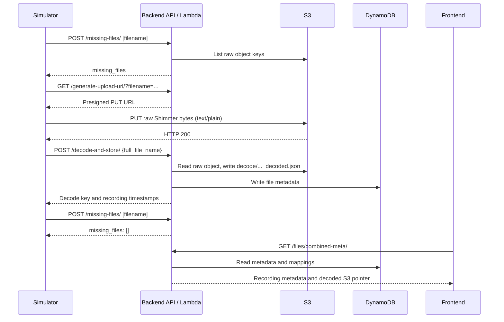

# Android upload simulation and validation

This guide documents the successful 2026-10-06 simulation and how to reproduce it. It uses the actual [simulator](../tools/simulate_android_upload.py), [committed run evidence](../tools/README.md), and current [backend source](../shimmer-data-sync-api/main.py). For broader context, see [System Architecture](SYSTEM_ARCHITECTURE.md) and [Operation Guide](OPERATION_GUIDE.md).

- Backend: https://wwr1eh4vg9.execute-api.us-east-2.amazonaws.com
- Frontend: https://clone.djm6m1z6lh719.amplifyapp.com

## 1. Purpose of the simulation

The simulator reproduces Android's HTTP/cloud synchronization protocol without an Android phone, Bluetooth, or the Android app runtime. It sends real recording bytes through this chain:

```text
client HTTP protocol
→ backend API
→ presigned S3 upload
→ decode
→ DynamoDB metadata
→ frontend-visible recording
```

It does **not** validate:

```text
Shimmer → Bluetooth
Android file acquisition
Android local SQLite state
background service behavior
permissions/app lifecycle
```

It also does not exercise Android scheduling/retries, frontend authentication/chart rendering, or daily aggregation. Successful cloud simulation is evidence for the phone's server path; physical-device testing remains separate. The simulator retains uploaded objects and metadata, so each successful fresh run adds a recording.

## 2. Upload protocol overview



Missing-file, URL-generation, decode, and metadata calls are **API control requests**. The **file transfer** is a separate PUT directly to S3: raw bytes do not pass through API Gateway or Lambda during upload. Lambda reads them from S3 when explicitly asked to decode. Upload alone does not trigger decoding.

## 3. How the presigned upload URL is generated

The current `generate_upload_url()` implementation is:

```python
tags = request.query_params.get("tags") if request else None
params = {"Bucket": S3_BUCKET, "Key": filename}
if tags:
    params["Tagging"] = tags
url = s3_client.generate_presigned_url(
    ClientMethod="put_object",
    Params=params,
    ExpiresIn=3600
)
return {"upload_url": url}
```

Without optional tags, this is equivalent to:

```python
s3_client.generate_presigned_url(
    ClientMethod="put_object",
    Params={"Bucket": S3_BUCKET, "Key": filename},
    ExpiresIn=3600,
)
```

The filename becomes the exact S3 object key, with no generated upload prefix. Boto3 signs locally using the Lambda IAM role's temporary credentials; the client needs no AWS credentials. The URL authorizes a temporary PUT for that bucket/key. The configured expiry is 3,600 seconds, approximately one hour; the signing credentials' lifetime can shorten its usability. The actual file bytes go directly to S3.

The deployed S3 client uses:

```python
s3_client = boto3.client(
    "s3", config=Config(signature_version="s3v4", s3={"addressing_style": "virtual"})
)
```

Lambda supplies the `us-east-2` region. Returned signed URLs use the regional host `shimmer-server-clone-databucket-wn9atsyogh42.s3.us-east-2.amazonaws.com`. An earlier PUT returned HTTP 307 `TemporaryRedirect` from the global S3 host. Regional SigV4/virtual-addressing configuration fixed that failure; subsequent PUT/decode validation passed. See [CORE validation](../shimmer-data-sync-api/CORE_VALIDATION.md) and backend fix commit `ce3f5a1`. Use each returned URL unchanged; do not rewrite its host or follow redirects to repair it.

## 4. Simulator usage

Run from the parent repository root with Python 3 and network access. Only the standard library is required; no AWS credentials or frontend login are needed. Backend Git history must contain the fixture if it is absent from the checkout.

The exact successful command was:

```bash
python3 tools/simulate_android_upload.py \
  --filename SIM_ANDROID_20261006_RUN1__20261006_180000__SIMULATOR__Shimmer_SIM-001__000.txt
```

That filename is retained in S3. **Repeating this exact command now aborts at the initial missing-files check before PUT.** For another successful run, omit `--filename` to generate a unique Android-style name or choose a fresh basename:

```bash
python3 tools/simulate_android_upload.py
python3 tools/simulate_android_upload.py \
  --filename SIM_ANDROID_REPRO__20261006_180001__SIMULATOR__Shimmer_SIM-001__000.txt
```

| Option | Actual behavior |
| --- | --- |
| `--filename NAME` | Upload basename; rejects path separators, CR/LF, `.` and `..`. Default includes a random device suffix and current UTC filename timestamp. Use Android-style naming so metadata parses meaningfully. |
| `--file PATH` | Reads another real raw Shimmer fixture; expands `~`. Default checks `shimmer-data-sync-api/test_files/000`, then loads `b19efb0:test_files/000` from backend Git history. Empty input fails. |
| `--api-base URL` | Defaults to the current backend. Only that exact clone URL, optionally with trailing slashes, is accepted. Arbitrary alternate backends are **not supported**. |
| `-h`, `--help` | Prints supported options without performing requests. |

Example with another fixture:

```bash
python3 tools/simulate_android_upload.py \
  --file /path/to/real/shimmer-recording \
  --api-base https://wwr1eh4vg9.execute-api.us-east-2.amazonaws.com
```

The simulator performs eight stages, uses a 45-second HTTP timeout, rejects redirects and signed URLs outside the clone's regional bucket, and avoids printing signed credentials. It requires successful HTTP responses and expected JSON, exits nonzero on failure, and compares the downloaded raw object byte-for-byte. Its extra verification requests go beyond Android's upload calls.

## 5. Test fixture

The successful run used a **real Shimmer binary recording**, not fabricated sensor data or a dummy text file. `text/plain` is the upload MIME type used by Android; it does not mean the fixture bytes are textual.

| Property | Verified value |
| --- | --- |
| Source | Backend Git history |
| Historical commit | `b19efb0` |
| Historical path | `test_files/000` |
| Raw size | **998,176 bytes** |
| SHA-256 | `bdbe73b87729e55dea7b3f05aaf6c0d91e385dbc56a9de307cd8ea54910d1695` |

To extract it for manual upload without adding it to the repository:

```bash
git -C shimmer-data-sync-api show b19efb0:test_files/000 > /tmp/shimmer-upload-fixture-000
wc -c /tmp/shimmer-upload-fixture-000
sha256sum /tmp/shimmer-upload-fixture-000
```

## 6. Exact validation procedure

Use the same fresh filename throughout. All eight HTTP stages in the recorded run returned HTTP 200. Direct AWS checks were independent administrator checks, not additional simulator stages. Steps below separate those checks explicitly.

### Step 1 — Initial missing-files check

POST `/missing-files/` with a JSON **array**:

```json
["<filename>"]
```

Expected: `{"missing_files":["<filename>"]}`. This establishes that the raw key is reported absent before upload. It does not check decoding or metadata. The simulator requires this exact result and stops if the name already exists. Current backend implementation lists only one S3 page; for larger buckets, confirm absence independently with `head-object` before relying on this check to avoid overwriting.

### Step 2 — Request upload URL

GET `/generate-upload-url/?filename=<URL-encoded-filename>`. Expected:

```json
{"upload_url":"https://..."}
```

Validate that the URL is HTTPS and targets the clone's regional bucket. Keep the signed query private and use it promptly.

### Step 3 — Direct S3 PUT

Send the fixture bytes unchanged to the returned URL using `PUT` and `Content-Type: text/plain`. Expected HTTP 200, normally with an empty response body. This mirrors `uploadFileToS3()` in the [Android transfer client](../shimmer-docking-android/app/src/main/java/com/example/myapplication/ShimmerFileTransferClient.java).

### Step 4 — Verify raw object

Confirm the raw S3 key exists and `ContentLength` equals the fixture size (998,176 for this fixture). Independent AWS validation also confirmed `ContentType: text/plain`. Downloading via `/generate-download-url/?filename=...` and comparing bytes proves content equality; the simulator performs that stronger check as its final stage.

### Step 5 — Trigger decode

POST `/decode-and-store/` with:

```json
{"full_file_name":"<filename>"}
```

Require `message: "Decode and store successful"`, matching `filename`, the expected `decode_s3_key`, and nonempty `recordedTimestamp`/`endRecordedTimestamp`. **Check the JSON for an `error` field even when HTTP status is 200**: the current route can return decode failures with HTTP 200.

### Step 6 — Verify decoded S3 object

Confirm creation of:

```text
decode/<filename-without-.txt>_decoded.json
```

GET `/get-decoded-file-url/?full_file_name=<URL-encoded-filename>`, capture `download_url`, then GET that exact URL. Require valid JSON with a nonempty `timestampCal` array. The successful fixture produced **30,240 samples** and a **10,549,123-byte** object with `ContentType: application/json`. These exact sizes/counts apply to the documented fixture and run, not arbitrary recordings.

### Step 7 — Verify DynamoDB metadata

Use a consistent-read `get-item` on the file metadata table keyed by the same `full_file_name`. Check `full_file_name`, `device`, `recordedTimestamp`, `endRecordedTimestamp`, and `decode_s3_key`. The decode pointer and timestamps must match the decode response and decoded data.

For independent storage checks, administrators can run the following in Bash with AWS CLI credentials authorized for the clone. Replace the profile placeholder; these credentials are for verification only, not for simulator uploads.

```bash
PROFILE='<authorized-AWS-profile>'
BUCKET='shimmer-server-clone-databucket-wn9atsyogh42'
TABLE='shimmer-server-clone-FileMetadataTable-1FARD0NWRCNXP'
FILENAME='SIM_ANDROID_20261006_RUN1__20261006_180000__SIMULATOR__Shimmer_SIM-001__000.txt'
DECODE_KEY="decode/${FILENAME%.txt}_decoded.json"
aws --profile "$PROFILE" --region us-east-2 sts get-caller-identity
aws --profile "$PROFILE" --region us-east-2 s3api head-object \
  --bucket "$BUCKET" --key "$FILENAME"
aws --profile "$PROFILE" --region us-east-2 s3api head-object \
  --bucket "$BUCKET" --key "$DECODE_KEY"
DDB_KEY=$(python3 -c 'import json,sys; print(json.dumps({"full_file_name":{"S":sys.argv[1]}}))' "$FILENAME")
aws --profile "$PROFILE" --region us-east-2 dynamodb get-item \
  --table-name "$TABLE" --consistent-read --key "$DDB_KEY"
```

Confirm the intended account before storage access (the recorded clone account was `837873138796`). For a new run, replace `FILENAME` with that run's name.

### Step 8 — Repeat missing-files check

POST the same array to `/missing-files/` again. Expected: `{"missing_files":[]}`. This confirms the uploaded raw key is recognized as present; decoded storage and metadata checks establish the rest of the pipeline.

### Step 9 — Frontend/backend visibility

GET `/files/combined-meta/`. Locate the exact `full_file_name` inside its nested response and compare the decode key and recording timestamps. The simulator searches recursively because the endpoint groups recordings by patient/device, recording-time window, and Shimmer side. This is the metadata endpoint used by the frontend's decoded-recording view; see [API service](../shimmer-sensor-dashboard/src/app/services/api.service.ts).

For manual UI confirmation, sign in at the current frontend, open **Shimmer Data** (`/home`), refresh, and clear filters. Look for `Shimmer_SIM`, patient `none`, Synced Date `2026-10-06`, and the 2010 recording window below. Device and full filename columns are hidden by default in that grid; use raw file listings in **Data Operations** (`/data-ops`) to filter by device/date and expand the filename. Open the decoded chart to confirm data rendering. The combined daily **Dashboard** view requires separate aggregation and is not an automatic result of this upload.

## 7. Successful validation evidence

The [run evidence](../tools/README.md) was committed with the simulator in parent commit `4a0a72dc79abafbcbfee0de4a6feae94180270c3`. It records all eight stages passing with HTTP 200 plus independent S3 `head-object` and consistent DynamoDB checks. The historical fixture's size and SHA-256 were rechecked while preparing this document. A read-only request to the deployed `/files/combined-meta/` also confirmed the retained record and fields below on 2026-10-06.

```text
Initial missing-files check     PASS
Presigned URL generation       PASS
Raw text/plain S3 PUT          PASS
Decode-and-store               PASS
Second missing-files check     PASS
Dashboard metadata visibility  PASS
Decoded JSON download          PASS
Raw byte-for-byte verification PASS
```

- Raw object: **998,176 bytes**, byte-for-byte equal to the historical fixture.
- Decoded `timestampCal` sample count: **30,240**.
- Decoded object size: **10,549,123 bytes**.
- Decoded key: `decode/SIM_ANDROID_20261006_RUN1__20261006_180000__SIMULATOR__Shimmer_SIM-001__000_decoded.json`.
- DynamoDB metadata: matching filename, decoded key, and recording window confirmed by independent consistent read.

“Dashboard metadata visibility” means the recording was found in the frontend's backend metadata response. Authenticated UI login and chart rendering were **not** tested in that simulator run; those are manual application checks. This documentation task did not rerun uploads or decoding.

## 8. Example frontend record

| Field | Successful simulator record |
| --- | --- |
| Device | `SIM_ANDROID_20261006_RUN1` |
| Full filename | `SIM_ANDROID_20261006_RUN1__20261006_180000__SIMULATOR__Shimmer_SIM-001__000.txt` |
| Filename date | `2026-10-06` |
| Shimmer | `Shimmer_SIM` |
| Patient | `none` (no mapping created) |
| Recorded start | `2010-10-02T22:43:51.951752+00:00` |
| Recorded end | `2010-10-02T22:53:50.596345+00:00` |

```text
filename timestamp ≠ recordedTimestamp
```

Recording-time displays derive from the fixture's decoded `timestampCal`: the backend converts the first and last Unix-seconds samples to UTC ISO timestamps. They do not use upload time. The synthetic filename contains 2026, while the real historical recording contains 2010. Filename-derived `date`/Synced Date can therefore show 2026 alongside 2010 start/end times. See `timestamp_cal_to_iso()` in backend source and `formatRecordedTimestamp()` in the [frontend grid](../shimmer-sensor-dashboard/src/app/comp/data-grid/data-grid.ts).

## 9. Manual URL-based upload

This independent Python equivalent requires only Python 3 and a real raw fixture. Extract the fixture using section 5, then run this from the repository root. It uses a fresh name, captures returned URLs in memory, transfers bytes directly to S3, and verifies the decoded result, metadata, and raw bytes. It writes a new recording to the clone. To use another recording, replace the local `fixture` path; retain a fresh Android-style filename.

```bash
python3 - <<'PY'
import json
from pathlib import Path
from urllib.parse import urlencode, urlsplit
from urllib.request import Request, HTTPRedirectHandler, build_opener
import uuid

api = "https://wwr1eh4vg9.execute-api.us-east-2.amazonaws.com"
fixture = Path("/tmp/shimmer-upload-fixture-000")
filename = f"SIM_MANUAL_{uuid.uuid4().hex[:8]}__20261006_180001__SIMULATOR__Shimmer_SIM-001__000.txt"
raw = fixture.read_bytes()
assert raw, "Empty fixture"

class NoRedirect(HTTPRedirectHandler):
    def redirect_request(self, req, fp, code, msg, headers, newurl):
        return None

http = build_opener(NoRedirect)

def call(method, url, body=None, content_type=None, as_json=True):
    headers = {"Content-Type": content_type} if content_type else {}
    with http.open(Request(url, data=body, headers=headers, method=method), timeout=45) as r:
        assert r.status == 200, f"Unexpected HTTP {r.status}"
        data = r.read()
    result = json.loads(data) if as_json else data
    assert not isinstance(result, dict) or not result.get("error"), "Backend error in JSON"
    return result

def post(path, payload):
    return call("POST", api + path, json.dumps(payload).encode(), "application/json")

def capability(path, query, field):
    response = call("GET", api + path + "?" + urlencode(query))
    url = response[field]
    parsed = urlsplit(url)
    assert parsed.scheme == "https"
    assert parsed.netloc == "shimmer-server-clone-databucket-wn9atsyogh42.s3.us-east-2.amazonaws.com"
    return url

def records(value):
    if isinstance(value, dict):
        if value.get("full_file_name") == filename:
            yield value
        for child in value.values():
            yield from records(child)
    elif isinstance(value, list):
        for child in value:
            yield from records(child)

# 1. Initial missing-files check; stop before overwriting an existing key.
assert post("/missing-files/", [filename]) == {"missing_files": [filename]}
# 2–3. Request and capture the backend-generated URL, then PUT raw bytes to S3.
upload_url = capability("/generate-upload-url/", {"filename": filename}, "upload_url")
call("PUT", upload_url, raw, "text/plain", as_json=False)
del upload_url
# 4–5. Trigger decode and check both status and success fields.
decoded = post("/decode-and-store/", {"full_file_name": filename})
assert decoded["message"] == "Decode and store successful"
assert decoded["filename"] == filename
assert decoded["decode_s3_key"] == f"decode/{Path(filename).stem}_decoded.json"
assert decoded["recordedTimestamp"] and decoded["endRecordedTimestamp"]
# 6. Verify raw presence, nested metadata, decoded arrays, and raw equality.
assert post("/missing-files/", [filename]) == {"missing_files": []}
record = next(records(call("GET", api + "/files/combined-meta/")))
for field in ("decode_s3_key", "recordedTimestamp", "endRecordedTimestamp"):
    assert record[field] == decoded[field]
url = capability("/get-decoded-file-url/", {"full_file_name": filename}, "download_url")
arrays = call("GET", url)
assert isinstance(arrays["timestampCal"], list) and arrays["timestampCal"]
url = capability("/generate-download-url/", {"filename": filename}, "download_url")
assert call("GET", url, as_json=False) == raw
print("PASS", filename, "samples:", len(arrays["timestampCal"]))
PY
```

Errors stop the sequence. Do not print or persist the URL variables. This example performs HTTP verification; use section 6's AWS commands for independent storage inspection and section 6 step 9 for UI checks. It contains no credentials or saved presigned URLs.

## 10. Verification methods

| Level | What to verify | Evidence from the successful run |
| --- | --- | --- |
| Protocol verification | Expected HTTP statuses and JSON, missing → present transition, successful decode fields and no `error`. | All eight simulator stages passed with HTTP 200. |
| AWS storage verification | Raw S3 object/size/bytes, decoded S3 object/arrays, DynamoDB metadata row and matching keys/timestamps. | Independent S3/DynamoDB checks plus decoded download and raw byte comparison passed. |
| Application verification | Backend metadata endpoint exposes the recording; authenticated frontend record/chart displays the data. | Metadata endpoint passed. Signed-in frontend record/chart checks remain manual. |

Passing all three levels gives strong evidence that the smartphone-to-cloud server path works. It does not establish Bluetooth acquisition or Android runtime behavior. An empty `missing_files` result alone proves neither successful decode nor frontend visibility.

## 11. Security note

Current backend routes and SAM HTTP API configuration have no API authentication requirement. Obtaining an upload URL currently requires only access to the backend endpoint; the simulator sends no bearer token. The presigned URL itself is scoped to an operation and bucket/key and expires. No permanent AWS credentials are exposed to the client, though the signed URL is an access capability and must be kept private.

Cognito frontend authentication is separate from backend API authentication. Signing into the website does not protect these backend routes. This guide documents current behavior and does not change or redesign authentication.

## 12. Troubleshooting

| Failure | Likely cause | What to inspect |
| --- | --- | --- |
| Filename not reported missing initially | Object already exists in S3 | Check the exact raw key with `head-object`; select a fresh filename. The retained validated name is expected to fail this precondition. |
| Upload URL generation fails | Backend/Lambda/IAM issue | Check status/JSON detail, Lambda logs, `S3_BUCKET`, region, role permissions, and the deployed API URL. Signing success alone does not prove permission to PUT. |
| PUT returns 307 | Regional S3/presigned URL configuration | Inspect returned host and S3 redirect response; compare deployed S3 client with regional SigV4 configuration. Do not rewrite the signed URL or follow the redirect. |
| PUT returns 403 | Signature/header/expiry mismatch | Obtain a fresh URL; inspect S3's error code, method, exact query/host, and required signed headers. Check IAM/bucket policy if it reports `AccessDenied`. Never log signed credentials. |
| Decode-and-store fails | Invalid fixture or missing raw object | Inspect JSON `error` even with HTTP 200, exact `full_file_name`, raw existence/size/bytes, and Lambda decoder logs. Dummy text is not a valid Shimmer fixture. |
| Metadata missing | DynamoDB write/decode issue | Inspect `DDB_FILE_TABLE`, table key `full_file_name`, consistent-read result, decode response, and Lambda logs. A decoded object can exist even if the later metadata write fails. |
| Wrong displayed date | Embedded Shimmer timestamp differs from filename | Compare `timestampCal[0]`, `recordedTimestamp`, filename date, and the specific UI column. The 2010 fixture date is expected. |
| Frontend record missing | Metadata endpoint/grouping/filter issue | Find exact filename recursively in `/files/combined-meta/`; refresh/clear UI filters, check patient/device and Shimmer side grouping, and use the 2010 recording date. Daily combined views require separate aggregation. |

For clone Lambda errors, inspect CloudWatch log group `/aws/lambda/shimmer-server-clone-MainApiFunction-hNr96vzCphw3` around the request time. Network failures before HTTP require checking local DNS/connectivity first. If the second missing-files check disagrees with a verified S3 object, inspect the backend's unpaginated listing noted in step 1.

## 13. Reproducibility checklist

```text
[ ] backend API reachable
[ ] choose real Shimmer fixture
[ ] run simulator
[ ] missing-files initial PASS
[ ] presigned PUT PASS
[ ] raw S3 object verified
[ ] decode PASS
[ ] decoded JSON verified
[ ] DynamoDB row verified
[ ] second missing-files PASS
[ ] frontend/backend visibility PASS
```
